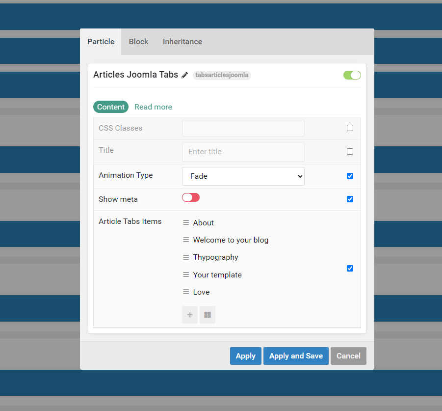
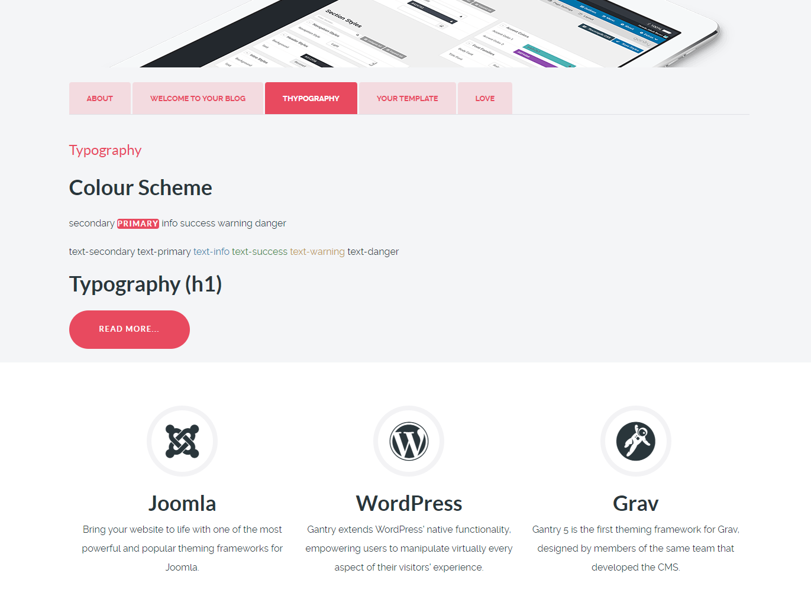

# gantry5-particle-tabs-articles
Drop the twig and yaml files into your template by going to TEMPLATE_DIR/custom/particles
*[docs Creating a New Particle](https://docs.gantry.org/gantry5/advanced/creating-a-new-particle)
## Template

